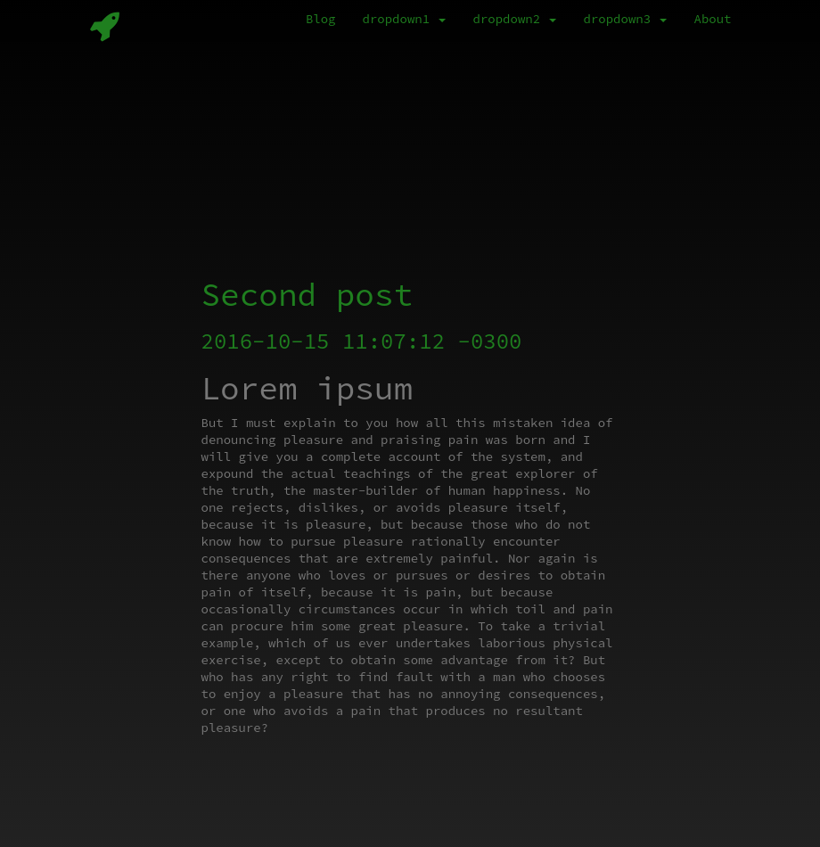

# jekyll-theme-potato-hacker

Welcome to your new Jekyll theme! In this directory, you'll find the files you need to be able to package up your theme into a gem. Put your layouts in `_layouts`, your includes in `_includes` and your sass in `_sass`. To experiment with this code, add some sample content and run `bundle exec jekyll serve` – this directory is setup just like a Jekyll site!



Check out the [demo](https://luxedo.github.io/jekyll-theme-potato-hacker/)

## Installation

Add this line to your Jekyll site's Gemfile:

```ruby
gem "jekyll-theme-potato-hacker"
```

And add this line to your Jekyll site's `_config.yml`:

```yaml
theme: jekyll-theme-potato-hacker
```

And then execute:

    $ bundle

Or install it yourself as:

    $ gem install jekyll-theme-potato-hacker

## Usage

This is a simple theme I made to my portfolio/blog https://luxedo.github.io/
There are four different categories of pages for this template:
* Main page `index.md` in the root.
* Item pages `_items` folder.
* Blog posts `_posts` folder.
* Dropdown pages `_dropdown` folder.

The dropdown menus are generated based on the [front matter](https://jekyllrb.com/docs/front-matter/) data in the files. Use the `dropdown` attribute to chose where the page will be placed.
```yaml
---
layout: page
title: dropdown1 item1
description: Test page
dropdown: dropdown1
---
```

## Contributing

Bug reports and pull requests are welcome on GitHub at https://github.com/luxedo/jekyll-theme-potato-hacker/issues. This project is intended to be a safe, welcoming space for collaboration, and contributors are expected to adhere to the [Contributor Covenant](http://contributor-covenant.org) code of conduct.

## Development

To set up your environment to develop this theme, run `bundle install`.

You theme is setup just like a normal Jelyll site! To test your theme, run `bundle exec jekyll serve` and open your browser at `http://localhost:4000`. This starts a Jekyll server using your theme. Add pages, documents, data, etc. like normal to test your theme's contents. As you make modifications to your theme and to your content, your site will regenerate and you should see the changes in the browser after a refresh, just like normal.

When your theme is released, only the files in `_layouts`, `_includes`, and `_sass` tracked with Git will be released.

## License

The theme is available as open source under the terms of the [GPL-3.0 License](https://www.gnu.org/licenses/gpl-3.0.en.html).
